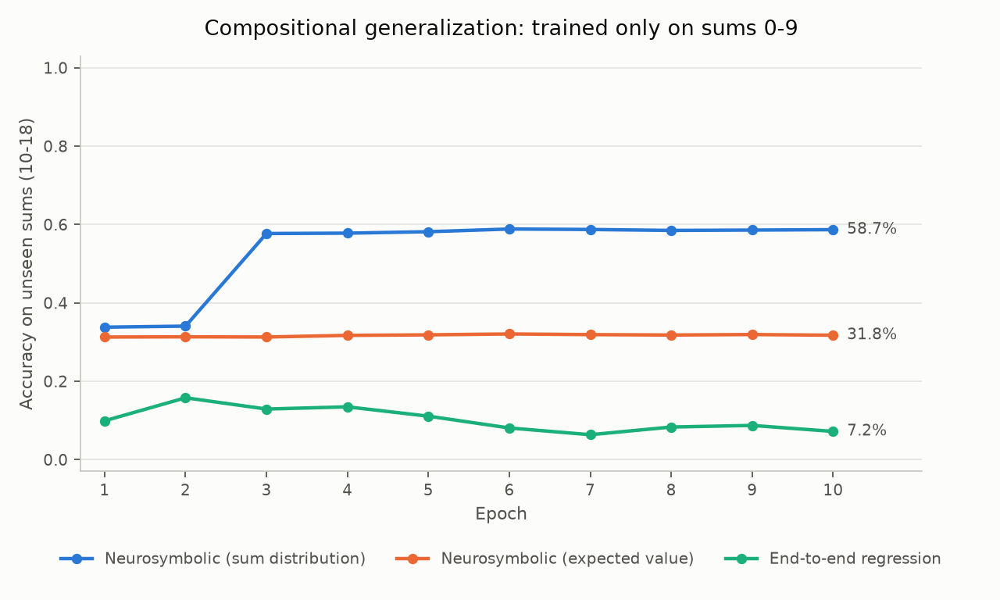

# Neurosymbolic Visual Math Solver

Reads images of handwritten arithmetic and solves them, where a neural network
handles *only* perception and a symbolic engine handles *all* reasoning. Trained
end to end on final answers alone — the CNN is never told what a digit is.

Given a 28×56 image of two MNIST digits side by side, the system outputs their
sum. Supervision is only ever `(image, sum)`. Digit recognition emerges purely
from being right or wrong about arithmetic.

---

## The headline result: compositional generalization

Train on digit pairs summing to **0–9**. Test on pairs summing to **10–18** —
combinations never seen together during training.



| Model | Accuracy on unseen sums | Parameters |
|---|---|---|
| **Neurosymbolic** (sum distribution) | **58.7%** | 108,618 |
| Neurosymbolic (expected value) | 31.8% | 108,618 |
| End-to-end CNN → regression | 7.2% | 250,817 |

The baseline loses while holding **more than twice the capacity**. This is a
result about structure, not size.

**The most telling detail is the shape of the baseline's curve.** Its training
loss fell steadily (1.32 → 0.44) while its held-out accuracy *rose to 15.8% at
epoch 2 and then declined to 7.2%*. Getting better at sums 0–9 made it worse at
10–18 — it learned the training range's ceiling as a fact about the world. The
neurosymbolic curve rises and stays flat: no learnable parameter sits anywhere
on the sum, so there is nothing there to overfit.

### That 58.7% is one broken digit

Per-digit accuracy of the neurosymbolic model: digits 0–8 score **97.6–99.7%**.
Digit 9 scores **0.0%** — it reads 9s as 7s with 94% confidence.

That single perceptual failure accounts for the entire number:

```
test pairs containing a 9:                      39.95%
predicted ceiling if 9 always fails:            58.62%
observed:                                       58.68%
```

**On held-out pairs containing no 9, accuracy is 97.70%** (n=6,005) — sums like
8+8=16 that never appeared in training, computed correctly, against 98.06% on
the unrestricted task. The symbolic layer generalized essentially perfectly; it
was handed a broken perceptual input.

Why 9 broke: capping training sums at 9 means a 9 can only pair with a 0, so it appears in 1.75% of digit slots (1,757 distinct images) and in just 3.49% of training pairs. That's likely enough images to learn from, but little enough loss weight that the network settled into confusing 9 with 7 and was never penalised enough to escape.

---

## How it works

```
                 ┌───────────────┐
  Image of two   │   CNN digit   │   P(digit1) ┐
  MNIST digits ─▶│  recognizer   │─────────────┤
  side by side   │   (learned)   │   P(digit2) ┘
                 └───────────────┘        │
                                          ▼
                             ┌─────────────────────────┐
                             │  Symbolic arithmetic    │
                             │  module (fixed, exact)  │
                             │  P(sum=s) = Σ P(i)·P(j) │
                             │            over i+j=s   │
                             └─────────────────────────┘
                                          │
                                          ▼
                                 distribution over sums
                                          │
                                          ▼
                          loss = NLL against the true sum
                                          │
                        gradients flow back through exact
                        arithmetic into the CNN's weights
```

The CNN never predicts a sum. The symbolic module has **no learnable
parameters** — it is a fixed `(10,10)` addition table and an `einsum`. The only
thing connecting them is a differentiable probability-weighted sum.
`pipeline.py` asserts `total_params == cnn_params` so a refactor cannot quietly
break this.

Both digit crops go through the **same** CNN. Weight sharing is deliberate: the
recognizer has to be position-independent.

### The key idea: differentiable symbolic execution

You cannot backpropagate through "look up 3+5 in a table" — `argmax` has zero
gradient almost everywhere. Instead, keep the full distribution and compute over
every possible digit pair:

```
P(sum = s) = Σ_{i+j=s}  P(d₁=i) · P(d₂=j)
```

Only multiplication and addition, so it is fully differentiable. When the CNN is
confident, this collapses onto exact integer arithmetic. When it is unsure, the
output spreads — and the resulting error is what tells it which way to move.

---

## The interesting failure: why expected value isn't enough

The natural formulation regresses on the **expected value** of the sum with an
L1 loss. It scores 97.4% on sums — and only **89.1%** on digits, with digit 4 at
exactly **0.0%**.

Inspecting the softmax over images of a true 4:

```
P(3) = 0.498    P(4) = 0.000    P(5) = 0.453     expected value 4.088
```

The network encoded "4" as a **50/50 superposition of 3 and 5**. Its mean is
right; its mode is wrong. This is optimal under that loss: an expected value
constrains only the *mean* of each digit distribution, never its shape, so a
hedge is exactly as good as a one-hot.

Computing the full distribution over sums and applying NLL removes the
degeneracy. A hedge now smears probability across neighbouring sums rather than
concentrating it — half-3/half-5 against a certain 5 puts mass on sums 8 and 10
and **zero on 9**, while its expected value is an innocent-looking 9.0.

| Objective | Digit accuracy | Sum accuracy |
|---|---|---|
| L1 on expected value | 0.8909 | 0.9744 |
| **NLL on sum distribution** | **0.9882** | **0.9806** |
| *Reference: trained with digit labels* | *0.9898* | *n/a* |

Same architecture, same data, same hyperparameters — only the objective changed.

Both objectives are kept in the repo (`loss_mode="expected"` / `"distribution"`)
so the comparison is reproducible.

---

## Digit recognition emerged from sums alone

Freeze the trained CNN, feed it individual MNIST digits, compare its `argmax`
against the true labels it never saw:

| | Digit accuracy |
|---|---|
| Sum-supervised (never saw a digit label) | **98.82%** |
| Digit-supervised baseline (Tier 0) | 98.98% |
| Gap | **0.16 pp** |

16 images out of 10,000 — inside run-to-run noise. A CNN trained on nothing but
"these two images sum to 8" matched one trained on 60,000 explicit digit labels.

Note also that **every error is a perception error**. A representative failure:
`8+1`, true sum 9, predicted `2.00` — not 8.5, not something uncertain. The CNN
read the handwritten 8 as a 1, and the symbolic layer did flawless arithmetic on
a wrong input. Errors are attributable to a specific half of the system, which
an end-to-end network cannot offer.

---

## Repo layout

```
├── data/
│   ├── load_mnist.py        MNIST download + normalization
│   └── make_pairs.py        Digit-pair dataset, sum labels, sum-range filter
├── models/
│   ├── cnn.py               Digit recognizer (returns logits)
│   ├── symbolic.py          Fixed differentiable arithmetic — no parameters
│   └── baseline.py          End-to-end regression control
├── pipeline.py              CNN → softmax → symbolic module → sum
├── train_tier0.py           Tier 0: ordinary MNIST classifier (99.0%)
├── train.py                 Tier 1: trains on sums alone
├── evaluate.py              (a) implicit digit accuracy  (b) generalization
└── findings.md              Running log of conclusions and insights
```

Every module runs standalone and asserts its own invariants — there is no test
suite, these take its place:

```bash
python -m models.symbolic     # shape, gradient flow, zero-parameter checks
python -m data.make_pairs     # image shape, label correctness, range filtering
python -m pipeline            # weight sharing, end-to-end gradient path
```

## Running it

```bash
uv venv --python 3.13 && source .venv/bin/activate
uv pip install -r requirements.txt

python train_tier0.py              # baseline CNN, ~99% MNIST
python -m train distribution       # the neurosymbolic pipeline
python -m evaluate a               # implicit digit accuracy
python -m evaluate b               # compositional generalization + figure
```

Auto-selects `mps` on Apple Silicon, falls back to CPU. Full Tier 1 training is
about two minutes; `evaluate b` trains three models and takes roughly six.

Results are seeded end to end — dataset sampling, weight initialization, and
shuffling — so the model comparisons differ only by architecture.

---

## What I'd extend next

- **De-confound the generalization test.** Oversample rare digits when building
  the 0–9 training set so digit frequency stays balanced while sums stay capped.
  That would isolate the compositional effect from the frequency effect and
  likely move the headline number from 58.7% toward 97%.
- **Multi-digit numbers** — a positional grammar combining per-digit
  distributions into a number distribution.
- **More operators.** Subtraction and multiplication are the same expected-value
  machinery with a different table; the code is structured so only the table
  changes.
- **Swap in DeepProbLog** and compare a real probabilistic logic program against
  this hand-rolled tensor version on speed, clarity, and results.

See [findings.md](findings.md) for the full log of what was learned along the
way, including several results that were not obvious in advance.
